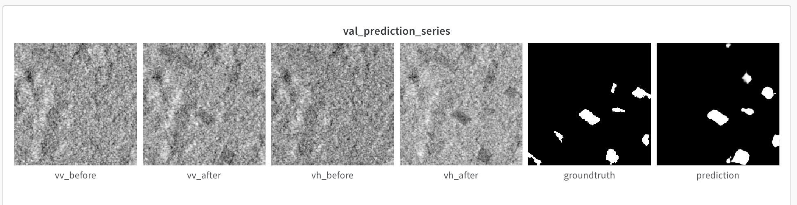

# AI4Good HS21 - Group 3b - Deforestation detection monitoring



## Setup

Create virtual environment and install the dependencies using pip:
```
pip install -r requirements.txt
```

## Create the dataset

To create the deforestation training dataset mentioned in the report, run the following script:

```
python3 data/create_deforestation_dataset.py \
    --name <DATASET_NAME> \
    -sd 2020-11-01 \
    -ed 2020-12-31 \
    --log-scale
    -aoi sampling_rectangles_2
    --scale 10
    --num-samples-per-area 400
    --months-before-acquisition 8
```

or download it directly from here [https://polybox.ethz.ch/index.php/s/pcQ6TSYS5nKJx9q](link).


## Training

To train the deforestation detection model:

```
python3 train.py \
    -d <PATH_TO_DATASET_DIRECTORY> \
    -o <PATH_TO_CHECKPOINTS_FOLDER> \
    --backbone efficientnet-b3 \
    -m deeplabv3+
```